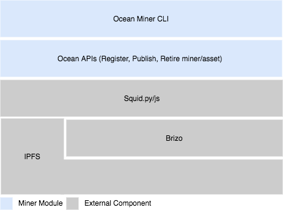

```
shortname: 17/MINER
name: Ocean Network Miner
type: Standard
status: Draft
version: 0.1
editor: Alex Coseru <alex@oceanprotocol.com>,
        Fang Gong <fang@oceanprotocol.com>,
        Sebastian Gerske <sebastian@oceanprotocol.com>,
        Ahmed Ali <ahmed@oceanprotocol.com>,
        Samer Sallam<samer@oceanprotocol.com>
        
```

# Ocean Miner

This OEP describes the main ocean miner architecture, design patterns and provides more implementation and technical details 
including the integration with the existing Ocean network components (Brizo, Aquarius, Squid, 
DID/DDO Definition).

**Disclaimer**

- This is NOT the final specification draft of the miner. It is only a specification for the MVP Miner. 
- This OEP doesn't discuss the token reward, please refer to [OEP-16](https://github.com/oceanprotocol/OEPs/blob/feature/OEP16-providers-rewards/16/README.md) for more details.

## Change Process
This document is governed by the [COSS](https://github.com/oceanprotocol/OEPs/2/README.md).

## Language
The key words "MUST", "MUST NOT", "REQUIRED", "SHALL", "SHALL NOT", "SHOULD", "SHOULD NOT", "RECOMMENDED", "NOT RECOMMENDED", "MAY", and "OPTIONAL" in this document are to be interpreted as described in [BCP 14](https://tools.ietf.org/html/bcp14) \[[RFC2119](https://tools.ietf.org/html/rfc2119)\] \[[RFC8174](https://tools.ietf.org/html/rfc8174)\] when, and only when, they appear in all capitals, as shown here.

# Motivation

Providers will be rewarded for granting access to public and free datasets as discussed in [OEP-16](https://github.com/oceanprotocol/OEPs/blob/feature/OEP16-providers-rewards/16/README.md). 
This requires running a miner node in order to receive a reward. 

# Design rationale
- The `metadata` url in the `service` section as it is shown in the current DID document definition [v0.2/ddo-example.json](https://github.com/oceanprotocol/OEPs/blob/master/7/v0.2/ddo-example.json) refers to where the actual metadata is stored in [Aquarius](https://github.com/oceanprotocol/aquarius). 
- By querying Aquarius to get the metadata such as [here](https://github.com/oceanprotocol/OEPs/tree/master/8/v0.3#example-of-remote-metadata), it contains three basic info which defines the data integrity of the dataset as follow:
   - `checksum`: the URL(s) checksum
   - `ecryptedFiles`:  encrypted file URLs array
   - `files`: files header list
- According to this metadata definition, when we try to add a second source, it implies that we need to update the `ecryptedFiles`, the `checksum` and the `files` list. 
Also, it requires to change the `checksum` value on-chain through `DIDRegistry` contract. Moreover, any change in the DID attributes like checksum requires owner permission. 
- To avoid these breaking changes, we will rely only on the `file checksum` (generated by IPFS node) as a reference point where each checksum is mapped to multiple DIDs. Further details will follow. 

# Design Requirements

- Defining simple integration methods within the context of the current code base.
- Data integrity MUST be fulfilled by storing the checksum on-chain and off-chain.
- The flow MUST preserve the ownership of the DID and the provenance of assets.
- Only Owner MUST transfer ownership.
- Other Data providers (second sourcers) MUST be incentivized for providing access. 
- The ocean miner capabilities SHOULD be platform agnostic (Azure, AWS, OpenStack, etc).

# Specification
- The following specifications use syntax from `Solidity 0.5.11`, `Python 3` and `Nodejs v10+`.
- Running miner might include running other services (i.e Brizo node).
- Any services that requires high availability should run in background (i.e event handler, Brizo, etc).

# High Level Architecture



- Miner CLI handles the core functionalities for the miner through APIs.
- APIs include (Register miner, publish asset, retire asset, and retire miner).
- Brizo node (Miner can run local Brizo node or attached to a remote one).
- IPFS Peer, (Miner runs local IPFS node which acts as a storage node for datasets).

# Miner's Lifecycle
In the following sub sections, we are going to discuss three phases of ocean miner life cycle. 

### 1. Install & run


```
# install
npm install ocean-miner
pip3 install ocean-miner
```
Installation script MUST install IPFS, Brizo, and [Protocol buffer](#protocol-buffer) 

A running miner implies that there is a service running in the background.

```bash
ocean-miner start # start a miner, IPFS daemon, and Brizo node.
ocean-miner stop  # stop the miner services (Brizo, and IPFS daemon)
ocean-miner restart # restart the miner services
```

Behind the scenes, the miner register API does the following:

- Starts the miner server in background
- Initialize IPFS node and start the daemon
- Configures and starts Brizo node 

### 2. Register 

Registering miner requires running IPFS node (This will be handled automatically by the miner). 
The miner initialization gets the local IPFS keypair ([public key](https://docs.ipfs.io/reference/api/cli/#ipfs-id) & [private keys](https://docs.ipfs.io/reference/api/cli/#ipfs-config-show)) 
to sign the Provider's Ethereum address. By [verifying](#verifying-on-chain) the IPFS peer RSA signature on-chain, The provider's Ethereum address, and 
the IPFS peer Id will be stored as a verified miner on Ocean network.
```
ocean-miner register \
    --address <ETHEREUM_ADDRESS> \
    --network <PACIFIC_NETWORK> \
```
- The Ethereum address, will be attached to the miner's `Brizo` node. 
- In case of pointing to another Brizo, the miner has to provide the Brizo endpoint (This might open a question for what if Brizo need to support multiple Ethereum addresses - Brizo as a service).


- [Exports deserialized IPFS peer keypairs](#export-keypairs) 
- [Setup Libp2p crypto.proto](#setup-libp2p-crypto-proto)
- [Sign Ethereum Address](#sign-messages-using-openssl)
- [Verify IPFS peer signature on-chain](#verify-ipfs-on-chain)

The same Ethereum address is attached to the Brizo node.


### 3. Publish 
TBD
### 4. Retire
TBD

# Implementation Details
#### protocol buffer

## Methods

### Miner

#### setup libp2p crypto proto

IPFS uses [Libp2p]() to manage the node discovery, key management crypto, and 
serialize keypairs using [protocol buffer](). So we need to install libp2p crypto.proto module 
in order to deserialize the IPFS keypairs.

- Install required packages:
```bash
pip3 install pybase64 cryptography pyrobuf PyCryptodome
```
- Download [crypto.proto](https://raw.githubusercontent.com/libp2p/go-libp2p-core/master/crypto/pb/crypto.proto) Libp2p scheme
```bash
wget https://raw.githubusercontent.com/libp2p/go-libp2p-core/master/crypto/pb/crypto.proto
sudo pyrobuf --install crypto.proto
```
- Check crypto.proto
````python
import crypto_proto as crypto_proto 
````

#### sign messages using openssl
Signing the sha256(message) using the deserialized private key
```bash
echo -n "hello world" | openssl dgst -sha256 -sign private.pem -out | xxd -p | tr -d \\n
42300051abb9b5f16320fc38878e3d3d6f5df726837d962378bc992c0983a7010fe902fa6085f6694e57bd4fa68f5397c18ec32033531375bf9e69a2f8d5a28f892da8b29a2f61c5fec9460668162d959bba5bd6e10b9ffa6eb9c6a233864a04a2e28e1af3f87b2352109bf55b71c52b23677421f4f9f27200e4a7a15012cf1ed2ce9aaf101a70d9351e9988a96f50246cf87309c4a3c4669b2c0af10a9c335016f4552dc06c94cf437dc09b7cc2e072d6e9f037b126bfdb8b4107812dbf13354f282b397a010b32571ac3e91a67052c5b7d5ceb15d3b41da1419e1f5bda30b7e9a88f4fb6d4d5a18b3cc10d1a996a8d382ca3c154082f5d2d50d5d418d63d73
```
#### export the exponent and modulus from the public key
```bash
$ openssl asn1parse -inform TXT -i -in public.pem -strparse 19
    0:d=0  hl=4 l= 266 cons: SEQUENCE          
    4:d=1  hl=4 l= 257 prim:  INTEGER           :B643126ED21D944953DF5572161CE7799F6946AC2FA55D72EF1B8817E8B95788B631F4166DE3388CCC341F7ADC6F1B532098963A8195A6EE409BC71C5F12FE47BBFF31E3F8F033EC2CF5F4AE723A71E26859F5C7D8A0A0B536B1597385DE88D5E5C6F019B0ED165EC70936C3650A684DB10A68767FD740672ECD916228E5955AF4DF10D848FFD1A0C3BB61511C3636443C187D5084893D9D12B02C3F312E25C853B2D86725B1DBDA30E268EC207C0D6BC99D312C4C1AF60AC82B1174984027F138F69779BD7733460402BB59D19B5B1BE7A42C2BBE601C316727671CF813CFBF3D334A52367E130BB5BD0BB482014055BDF6B0077286B01811DD698AD4E3BD7D
  265:d=1  hl=2 l=   3 prim:  INTEGER           :010001
```
The exponent is: `010001`
The modulus is : `B643126ED21D944953DF5572161CE7799F6946AC2FA55D72EF1B8817E8B95788B631F4166DE3388CCC341F7ADC6F1B532098963A8195A6EE409BC71C5F12FE47BBFF31E3F8F033EC2CF5F4AE723A71E26859F5C7D8A0A0B536B1597385DE88D5E5C6F019B0ED165EC70936C3650A684DB10A68767FD740672ECD916228E5955AF4DF10D848FFD1A0C3BB61511C3636443C187D5084893D9D12B02C3F312E25C853B2D86725B1DBDA30E268EC207C0D6BC99D312C4C1AF60AC82B1174984027F138F69779BD7733460402BB59D19B5B1BE7A42C2BBE601C316727671CF813CFBF3D334A52367E130BB5BD0BB482014055BDF6B0077286B01811DD698AD4E3BD7D`
#### export keypairs

The `exporter.py` module does:
- load keypairs from IPFS config file
- decode the public and private key
- deserialize the keypair
- verifies that keypairs are exported correctly

```python
# load IPFS serialized keypairs from the configuration file
def load_keypairs(path, local=True):
    return read_ipfs_configuration(path,local)

# uses IPFS protocol buffer scheme to deserialize keypairs
def deserialize(byte_message, proto_type):
    module_, class_ = proto_type.rsplit('.', 1)
    class_ = getattr(crypto_proto, class_)
    rv = class_()
    rv.ParseFromString(byte_message)
    return rv

# generate the SHA256 hash
def digest(message, hash_algorithm="SHA-256"):
    if (hash_algorithm == "SHA-256"):
        digested = SHA256.new()
    else:
        raise Exception("The hash algorithm isn't supported")
    digested.update(message.encode("utf8"))
    return digested

# sign messages
def sign(private_key, message, hash_algorithm="SHA-256"):
    key = RSA.importKey(private_key)
    signer = PKCS1_v1_5.new(key)
    digested = digest(message)
    return base64.b64encode(signer.sign(digested))

# verfy signature off-chain (only used once during registration)
def verify(public_key, signature, message, hash_algorithm="SHA-256"):
    key = RSA.importKey(public_key)
    signer = PKCS1_v1_5.new(key)
    digested = digest(message,hash_algorithm)
    return signer.verify(digested, signature)
     
```
### Keeper
#### verify ipfs on chain

This is the contract interface of (`RSAVerifier.sol`):

```javascript
 /** @dev Verify RSA PKCSv1.5 SHA256 signature
  * All the parameters MUST be in (Hexadecimal representation)
  * The exponent length MUST be equal to the modulus length
  * This method will hash the data using sha256, then uses
  * Modulus (generated from the public key) and the exponent to
  * verify the signature. 
  * @param _data to verify 
  * @param _s is signature
  * @param _e is the exponent
  * @param _m is the modulus
  * @return 0 if success, >0 otherwise
 */    
 function verifyRSAPKCS1(
    bytes memory _data, 
    bytes memory _s, 
    bytes memory _e, 
    bytes memory _m
 ) external view returns (uint)
```
### Events
TBD
### Required changes
TBD

# Vector Attacks